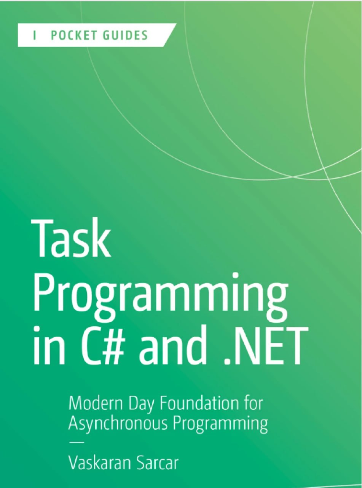

<p align="center">
  <a href="https://github.com/hheydarian/csharp-12-in-a-nutshell-persian">
    
  </a>
</p>

<h1 align="center">📘 ترجمه فارسی کتاب Task Programming in C# and .NET</h1>

<p align="center">
 پایه‌ای مدرن برای یادگیری برنامه‌نویسی ناهمگام در سی‌شارپ و دات‌نت
</p>

<p align="center">
  
  
  
  
  
</p>


---

## ✨ معرفی پروژه

کتاب **Task Programming in C# and .NET** نوشته *Vaskaran Sarcar* یکی از منابع مهم و کاربردی برای یادگیری **Task** و **برنامه‌نویسی ناهمگام (Asynchronous Programming)** در دات‌نت است.  

این ریپازیتوری تلاشی است برای ارائه نسخه‌ای فارسی، جامع و دقیق از این کتاب برای جامعه فارسی‌زبان برنامه‌نویسان. امیدواریم این کار یادگیری مفاهیم پیشرفته برنامه‌نویسی در #C و دات‌نت را ساده‌تر و عمیق‌تر کند 🚀


---

## ⚙️ پیش‌نیاز مطالعه

🔹 برای تجربه خوانایی بهتر در مرورگر، توصیه می‌کنیم افزونه [فونت ایران](https://chromewebstore.google.com/detail/fontiran/edbchgkbejkdkdkpgenlaciegoidmjoh) رو نصب کنید.

---

## 🙌 راه‌های مشارکت

ما به حضور شما تو این پروژه افتخار می‌کنیم! مشارکت‌تون می‌تونه از راه‌های زیر باشه:

- ✍️ **ترجمه فصل‌های باقی‌مانده**
- 🔎 **بازبینی و اصلاح ترجمه‌های فعلی**
- 💡 **پیشنهادات فنی یا ادبی برای بهبود متن**
- 🎨 **مرتب‌سازی و فرمت‌دهی کدها برای خوانایی بیشتر**
-  🗨️ **اگر قصد داشتید از هوش مصنوعی استفاده کنید در ترجمه، می تونید این متن [پرامپت](assets/prompt.md ) رو بهش بدید.**

---

## 📚 وضعیت ترجمه


<ul dir="rtl">
<ul dir="rtl">
  <li><b>00 - Introduction:</b> مقدمه (ترجمه شده ✅)</li>
  <li><b>01 - Introduction to Task:</b> معرفی Task (ترجمه شده ✅)</li>
  <li><b>02 - Task Creation and Execution:</b> ایجاد و اجرای Task (ترجمه شده ✅)</li>
  <li><b>03 - Continuations:</b> ادامه کارها (در حال ترجمه 🟡)</li>
  <li><b>04 - Exception Handling:</b> مدیریت استثناها (در حال ترجمه 🟡)</li>
  <li><b>05 - Task Cancellation:</b> لغو Task (ترجمه نشده ❌)</li>
  <li><b>06 - Parallel Programming with Task:</b> برنامه‌نویسی موازی با Task (ترجمه نشده ❌)</li>
  <li><b>07 - Advanced Task Programming:</b> مباحث پیشرفته در Task (ترجمه نشده ❌)</li>
</ul>
</ul>


---
## 🔗 فصل‌های کتاب (با لینک)
<div align="center">
  
| شماره | نام فصل (انگلیسی)                         | نام فصل (فارسی)                          | وضعیت | لینک                                               |
|-------|-------------------------------------------|-------------------------------------------|--------|----------------------------------------------------|
| 00    | Introduction                             | مقدمه                                    | ✅     | [Introduction](Book/00/Introduction.md) |
| 01    | Asynchronous Programming and Tasks       | برنامه‌نویسی ناهمزمان و Task              | ✅     | [Asynchronous-Programming-and-Tasks](Book/01/Asynchronous-Programming-and-Tasks.md) |
| 02    | Task Creation and Execution              | ایجاد و اجرای Task                        | ✅     | [Task-Creation-and-Execution](Book/02/Task-Creation-and-Execution.md) |
| 03    | Continuation and Nested Tasks            | ادامه‌کارها و Taskهای تو در تو            | 🟡     | [Continuation-and-Nested-Tasks](Book/03/Continuation-and-Nested-Tasks.md) |
| 04    | Exception Handling                       | مدیریت استثناها                           | 🟡     | [Exception-Handling](Book/04/Exception-Handling.md) |
| 05    | Managing Cancellations                   | مدیریت لغو در Task                        | ❌     | [Managing-Cancellations](Book/05/Managing-Cancellations.md) |
| 06    | Bonus                                    | برنامه‌نویسی موازی با Task                | ❌     | [Bonus](Book/06/Bonus.md) |
| 07    | APPENDIX-A                               | ضمیمه A – مباحث تکمیلی                    | ❌     | [APPENDIX-A](Book/APPENDIX-A/APPENDIX-A.md) |
| 08    | APPENDIX-B                               | ضمیمه B – مباحث تکمیلی                    | ❌     | [APPENDIX-B](Book/APPENDIX-B/APPENDIX-B.md) |

</div>


🛑 قبل از شروع ترجمه یا تغییرات بزرگ، لطفاً یه [Issue](https://github.com/hheydarian/clean-code-in-csharp-persian/issues) باز کن یا با [hamdhydryan12@gmail.com](mailto:hamdhydryan12@gmail.com) در ارتباط باش.

---
## 🧩 اصول ساختاری پروژه

- فایل‌ها باید با فرمت `.md` نوشته بشن
- کدها داخل بلوک ```csharp نوشته بشن
- عکس‌ها داخل پوشه `assets/image/` ذخیره بشن
- از تگ های HTML استفاده نکنید. یادگیری [Markdown](https://markdown-fa-book.vercel.app/)


---

## 🛡️ مجوز و حقوق نشر
<ul dir="rtl">
<li><b>حقوق نشر و کپی‌رایت کتاب اصلی: </b> حقوق نشر و کپی‌رایت کتاب اصلی متعلق به ناشر (O'Reilly Media) و مؤلف (Joseph Albahari) است. این پروژه یک تلاش مستقل برای ارائه ترجمه فارسی است و تلاش برای اخذ مجوز رسمی ترجمه از صاحبان اصلی اثر در حال انجام است. قبل از استفاده یا بازنشر این ترجمه، لطفاً از وضعیت حقوقی آن اطمینان حاصل کنید.
  </li>
<li><b>متن ترجمه: </b> متن ترجمه شده این کتاب (توسط مترجم/تیم ترجمه) تحت مجوز (CC BY-NC-SA 4.0) منتشر می‌شود. این بدین معنی است که شما می‌توانید این ترجمه را بازنشر، اقتباس و تغییر دهید، به شرط آنکه نام خالق اصلی (مترجمین) را ذکر کرده، برای مقاصد غیرتجاری استفاده نمایید و نسخه‌های مشتق شده را تحت همین لایسنس منتشر کنید.  </li>
<li><b>نمونه کدهای داخل کتاب: </b> تمامی نمونه کدهای موجود در این پروژه، تحت MIT License منتشر شده‌اند. شما مجاز به استفاده و توزیع مجدد این کدها هستید.
    </li>
</ul>

---


## 🌟 قدردانی

سپاس ویژه از همه عزیزانی که وقت گذاشتن و مشارکت کردن. شما هستید که این پروژه رو زنده نگه می‌دارید. 🌱

---

<p align="center">ساخته شده با ❤️ توسط برنامه‌نویسان برای برنامه‌نویسان</p>
