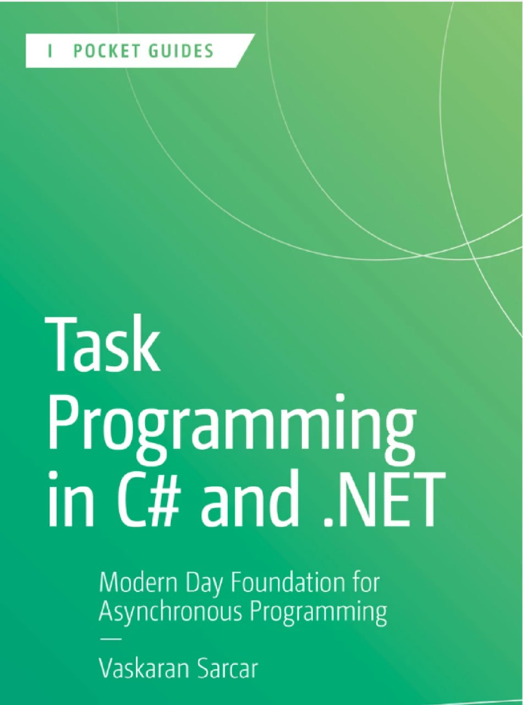

<p align="center">
  <a href="https://github.com/hheydarian/csharp-12-in-a-nutshell-persian">
    
  </a>
</p>

<h1 align="center">📘 ترجمه فارسی کتاب Task Programming in C# and .NET</h1>

<p align="center">
 پایه‌ای مدرن برای یادگیری برنامه‌نویسی ناهمگام در سی‌شارپ و دات‌نت
</p>

<p align="center">
  
  
  

  


</p>

<h1>
<p align="center">
   <a href="https://hheydarian.github.io/Gitab/" target="_blank"><strong>  گیتاب —  نسخه آنلاین کتاب </strong></a>
</p>
 </h1>

---

## ✨ معرفی پروژه

کتاب **Task Programming in C# and .NET** نوشته‌ی *Vaskaran Sarcar* از منابع ارزشمند برای یادگیری مفاهیم **Task** و **برنامه‌نویسی ناهمگام (Asynchronous Programming)** در دات‌نت به شمار می‌آید.  

هدف این ریپازیتوری، ارائه‌ی نسخه‌ای **فارسی، روان و دقیق** از این کتاب است تا جامعه‌ی فارسی‌زبان برنامه‌نویسان بتوانند مفاهیم پیشرفته‌ی برنامه‌نویسی در #C و دات‌نت را راحت‌تر و عمیق‌تر بیاموزند 🚀


---

## ⚙️ پیش‌نیاز مطالعه

🔹 برای تجربه خوانایی بهتر در مرورگر، توصیه می‌کنیم افزونه [فونت ایران](https://chromewebstore.google.com/detail/fontiran/edbchgkbejkdkdkpgenlaciegoidmjoh) رو نصب کنید.

---

## 🙌 راه‌های مشارکت

ما به حضور شما تو این پروژه افتخار می‌کنیم! مشارکت‌تون می‌تونه از راه‌های زیر باشه:

- 🔎 **بازبینی و اصلاح ترجمه‌های فعلی**
- 💡 **پیشنهادات فنی یا ادبی برای بهبود متن**
- 🎨 **مرتب‌سازی و فرمت‌دهی کدها برای خوانایی بیشتر**
-  🗨️ **اگر قصد داشتید از هوش مصنوعی استفاده کنید در ترجمه، می تونید این متن [پرامپت](assets/prompt.md ) رو بهش بدید.**

---

## 🔗 فصل‌های کتاب (با لینک)
<div align="center">
  
| شماره | نام فصل (انگلیسی)                  | نام فصل (فارسی)                            | وضعیت | لینک                                                                                |
| ----- | ---------------------------------- | ------------------------------------------ | ----- | ----------------------------------------------------------------------------------- |
| 00    | Introduction                       | مقدمه                                      | ✅     | [Introduction](Book/00/Introduction.md)                                             |
| 01    | Asynchronous Programming and Tasks | برنامه‌نویسی ناهمزمان و تسک‌ها             | ✅     | [Asynchronous-Programming-and-Tasks](Book/01/Asynchronous-Programming-and-Tasks.md) |
| 02    | Task Creation and Execution        | ایجاد و اجرای تسک‌ها                       | ✅     | [Task-Creation-and-Execution](Book/02/Task-Creation-and-Execution.md)               |
| 03    | Continuation and Nested Tasks      | ادامه‌کارها و تسک‌های تو در تو             | ✅     | [Continuation-and-Nested-Tasks](Book/03/Continuation-and-Nested-Tasks.md)           |
| 04    | Exception Handling                 | مدیریت استثناها                            | ✅     | [Exception-Handling](Book/04/Exception-Handling.md)                                 |
| 05    | Managing Cancellations             | مدیریت لغو تسک‌ها                          | ✅     | [Managing-Cancellations](Book/05/Managing-Cancellations.md)                         |
| 06    | Bonus                              | مطالب تکمیلی | ✅    | [Bonus](Book/06/Bonus.md)                                                           |
| 07    | APPENDIX-A                         | ضمیمه A – مباحث تکمیلی                     | ✅    | [APPENDIX-A](Book/APPENDIX-A/APPENDIX-A.md)                                         |
| 08    | APPENDIX-B                         | ضمیمه B – مباحث تکمیلی                     | ✅     | [APPENDIX-B](Book/APPENDIX-B/APPENDIX-B.md)                                         |

</div>


🛑 قبل از شروع تغییرات، لطفاً یه [Issue](https://github.com/hheydarian/clean-code-in-csharp-persian/issues) باز کن یا با [hamdhydryan12@gmail.com](mailto:hamdhydryan12@gmail.com) در ارتباط باش.

---
## 🧩 اصول ساختاری پروژه

- فایل‌ها با فرمت `.md` نوشته شدن
- کدها داخل بلوک ```csharp نوشته شدن
- عکس‌ها داخل پوشه `assets/image/` ذخیره شدن
   یادگیری [Markdown](https://markdown-fa-book.vercel.app/)


---

## 🛡️ مجوز و حقوق نشر

<ul dir="rtl">
<li><b>حقوق نشر و کپی‌رایت کتاب اصلی:</b> حقوق نشر و کپی‌رایت کتاب اصلی متعلق به  (Vaskaran Sarcar) است. این پروژه یک تلاش مستقل برای ارائه ترجمه فارسی است   </li>
<li><b>متن ترجمه:</b>متن ترجمه شده این کتاب (توسط مترجم) تحت مجوز <a href="https://creativecommons.org/licenses/by-nc-sa/4.0/">(CC BY-NC-SA 4.0)</a> منتشر می‌شود. </li>
<li><b>نمونه کدهای داخل کتاب:</b> تمامی نمونه کدهای موجود در این پروژه، تحت <a href="https://opensource.org/licenses/MIT">MIT License</a> منتشر شده‌اند. </li>
</ul>


---


## 🌟 قدردانی

از همراهی و حمایت شما سپاسگزاریم؛ **شما هستید که این پروژه را زنده و پویا نگه می‌دارید.** 🌱  

---

<p align="center"> ساخته‌شده با ❤️ توسط حامد برای جامعه‌ی برنامه‌نویسان فارسی‌زبان</p>
